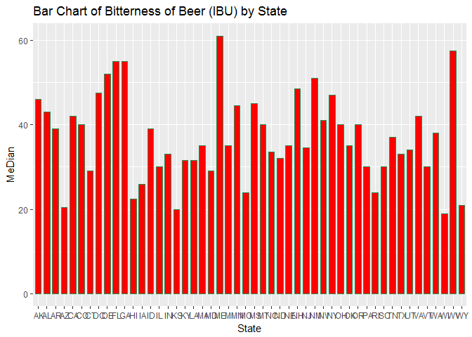
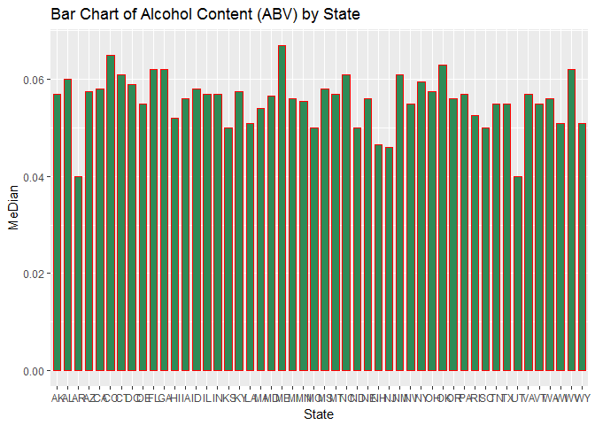
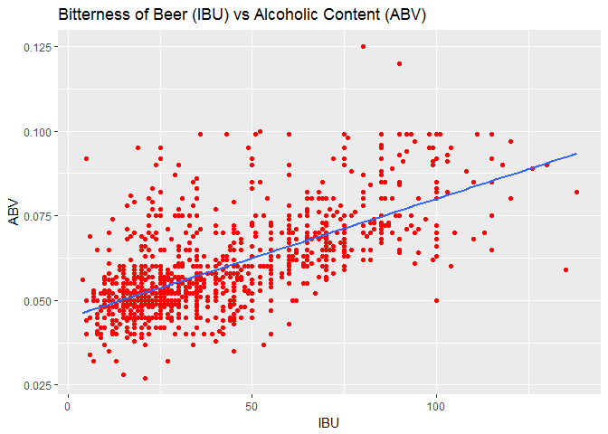

Beers and Breweries in the US
=============================

Author: Kevin Okiah
-------------------

Course: SMU MSDS6306
--------------------

### Introduction

In this report, we explore beers and breweries data for the 51 states in
the US. The steps and procedures taken in this analysis are stipulated
below.We successfully merge two datasets `Beers dataset` which contains
a list of 2410 US craft beers and `Breweries dataset` containing 558 US
breweries.

### Structure our repository and files in them

### Running this reproducible research in R

Begin by reading the README.md file in
{<https://github.com/kevimwe/DoingDataScienceCaseStudy1>}. Clone or
download this GitHub directory and its subdirectories. This markdown
document can be gerated by running either `batch.R` or
`Case_Study_Batch.Rmd`

### Analysis

We begin this analysis by loading R libraries that we will need. This is
achived by running `load_libraries.R` which is in the analysis folder.
`load_libraries.R` calls p\_load from `pacman` library that checks if a
library is installed or not, if not it installs it and loads the library
for the R session

    #get Working Directory
    y<-getwd()
    #load libraries required to run this project
    source(paste0(y,"/analysis/load_libraries.R"))

Once we have loaded all the libraries that we need, we procede to to
load `Beers` and `Breweries` datasets. `load_and_explore_data.R` found
in the analysis folder is geared for this loading and exploratory
analysis of this two dataset. We check for the number or rows and
columns, column names and structure of each dataset using str() command
which is available in base R. `load_and_explore_data.R` is excecuted by
running the codeblock below

    #load data to R
    source(paste0(y,"/analysis/load_and_explore_data.R"))

    ## Beers dataset /n'data.frame':    2410 obs. of  7 variables:
    ##  $ Name      : Factor w/ 2305 levels "#001 Golden Amber Lager",..: 1638 577 1705 1842 1819 268 1160 758 1093 486 ...
    ##  $ Beer_ID   : int  1436 2265 2264 2263 2262 2261 2260 2259 2258 2131 ...
    ##  $ ABV       : num  0.05 0.066 0.071 0.09 0.075 0.077 0.045 0.065 0.055 0.086 ...
    ##  $ IBU       : int  NA NA NA NA NA NA NA NA NA NA ...
    ##  $ Brewery_id: int  409 178 178 178 178 178 178 178 178 178 ...
    ##  $ Style     : Factor w/ 100 levels "","Abbey Single Ale",..: 19 18 16 12 16 80 18 22 18 12 ...
    ##  $ Ounces    : num  12 12 12 12 12 12 12 12 12 12 ...
    ## Breweries dataset /n'data.frame':    558 obs. of  4 variables:
    ##  $ Brew_ID: int  1 2 3 4 5 6 7 8 9 10 ...
    ##  $ Name   : Factor w/ 551 levels "10 Barrel Brewing Company",..: 355 12 266 319 201 136 227 477 59 491 ...
    ##  $ City   : Factor w/ 384 levels "Abingdon","Abita Springs",..: 228 200 122 299 300 62 91 48 152 136 ...
    ##  $ State  : Factor w/ 51 levels " AK"," AL"," AR",..: 24 18 20 5 5 41 6 23 23 23 ...

### Research Questions

#### 1. How many breweries are present in each state?

    # I am using the count function to count the number of breweries grouped by "state"
    names(breweries) #print the column names for breweries dataset

    ## [1] "Brew_ID" "Name"    "City"    "State"

    count(breweries, "State")

    ##    State freq
    ## 1     AK    7
    ## 2     AL    3
    ## 3     AR    2
    ## 4     AZ   11
    ## 5     CA   39
    ## 6     CO   47
    ## 7     CT    8
    ## 8     DC    1
    ## 9     DE    2
    ## 10    FL   15
    ## 11    GA    7
    ## 12    HI    4
    ## 13    IA    5
    ## 14    ID    5
    ## 15    IL   18
    ## 16    IN   22
    ## 17    KS    3
    ## 18    KY    4
    ## 19    LA    5
    ## 20    MA   23
    ## 21    MD    7
    ## 22    ME    9
    ## 23    MI   32
    ## 24    MN   12
    ## 25    MO    9
    ## 26    MS    2
    ## 27    MT    9
    ## 28    NC   19
    ## 29    ND    1
    ## 30    NE    5
    ## 31    NH    3
    ## 32    NJ    3
    ## 33    NM    4
    ## 34    NV    2
    ## 35    NY   16
    ## 36    OH   15
    ## 37    OK    6
    ## 38    OR   29
    ## 39    PA   25
    ## 40    RI    5
    ## 41    SC    4
    ## 42    SD    1
    ## 43    TN    3
    ## 44    TX   28
    ## 45    UT    4
    ## 46    VA   16
    ## 47    VT   10
    ## 48    WA   23
    ## 49    WI   20
    ## 50    WV    1
    ## 51    WY    4

### 2. Merge beer data with breweries data by brewery id. Print first 6 observations and the last six observations to check the merged file.

    names(breweries) #Checking the  column names for breweries dataset

    ## [1] "Brew_ID" "Name"    "City"    "State"

    names(beers) #Checking column names for breweries dataset

    ## [1] "Name"       "Beer_ID"    "ABV"        "IBU"        "Brewery_id"
    ## [6] "Style"      "Ounces"

    #renaming the breweries column name "Brew ID" to "Brewery_id" to match beers brewery_id
    names(breweries)<-c("Brewery_id","Name","City", "State")

    # merge two data frames by ID
    Brewery_and_Beer <- merge(breweries,beers,by=c("Brewery_id"))

    head(Brewery_and_Beer) # printing the first 6 observations

    ##   Brewery_id             Name.x        City State        Name.y Beer_ID
    ## 1          1 NorthGate Brewing  Minneapolis    MN       Pumpion    2689
    ## 2          1 NorthGate Brewing  Minneapolis    MN    Stronghold    2688
    ## 3          1 NorthGate Brewing  Minneapolis    MN   Parapet ESB    2687
    ## 4          1 NorthGate Brewing  Minneapolis    MN  Get Together    2692
    ## 5          1 NorthGate Brewing  Minneapolis    MN Maggie's Leap    2691
    ## 6          1 NorthGate Brewing  Minneapolis    MN    Wall's End    2690
    ##     ABV IBU                               Style Ounces
    ## 1 0.060  38                         Pumpkin Ale     16
    ## 2 0.060  25                     American Porter     16
    ## 3 0.056  47 Extra Special / Strong Bitter (ESB)     16
    ## 4 0.045  50                        American IPA     16
    ## 5 0.049  26                  Milk / Sweet Stout     16
    ## 6 0.048  19                   English Brown Ale     16

    tail(Brewery_and_Beer) #printing the last 6 observations

    ##      Brewery_id                        Name.x          City State
    ## 2405        556         Ukiah Brewing Company         Ukiah    CA
    ## 2406        557       Butternuts Beer and Ale Garrattsville    NY
    ## 2407        557       Butternuts Beer and Ale Garrattsville    NY
    ## 2408        557       Butternuts Beer and Ale Garrattsville    NY
    ## 2409        557       Butternuts Beer and Ale Garrattsville    NY
    ## 2410        558 Sleeping Lady Brewing Company     Anchorage    AK
    ##                         Name.y Beer_ID   ABV IBU                   Style
    ## 2405             Pilsner Ukiah      98 0.055  NA         German Pilsener
    ## 2406         Porkslap Pale Ale      49 0.043  NA American Pale Ale (APA)
    ## 2407           Snapperhead IPA      51 0.068  NA            American IPA
    ## 2408         Moo Thunder Stout      50 0.049  NA      Milk / Sweet Stout
    ## 2409  Heinnieweisse Weissebier      52 0.049  NA              Hefeweizen
    ## 2410 Urban Wilderness Pale Ale      30 0.049  NA        English Pale Ale
    ##      Ounces
    ## 2405     12
    ## 2406     12
    ## 2407     12
    ## 2408     12
    ## 2409     12
    ## 2410     12

### 3. Report the number of NA’s in each column.

    # function to count the number of NAs per column
    NA_counter<-function(y){
      sum(length(which(is.na(y))))
    }
    # Using Sapply to call the NA_counter on Brewery_and_beer dataset
    NA_count <-sapply(Brewery_and_Beer, NA_counter)
    NA_count <- data.frame(NA_count)
    print(NA_count)

    ##            NA_count
    ## Brewery_id        0
    ## Name.x            0
    ## City              0
    ## State             0
    ## Name.y            0
    ## Beer_ID           0
    ## ABV              62
    ## IBU            1005
    ## Style             0
    ## Ounces            0

### 4. Compute the median alcohol content and international bitterness unit for each state. Plot a bar chart to compare.

This code block caclculate the median alcohol content(ABV) and
International Bitterness (IBU) and plots a bar chart to compare them

    #clean data
    Brewery_and_Beer<-na.omit(Brewery_and_Beer)

    #Median IBU->international bitterness by state
    IBU_by_State <- by( Brewery_and_Beer$IBU, Brewery_and_Beer$State, median)
    IBU_by_State<-as.data.frame(IBU_by_State)
    names(IBU_by_State) = c("State", "MeDian")

    print(IBU_by_State)

    ##    State MeDian
    ## 1     AK   46.0
    ## 2     AL   43.0
    ## 3     AR   39.0
    ## 4     AZ   20.5
    ## 5     CA   42.0
    ## 6     CO   40.0
    ## 7     CT   29.0
    ## 8     DC   47.5
    ## 9     DE   52.0
    ## 10    FL   55.0
    ## 11    GA   55.0
    ## 12    HI   22.5
    ## 13    IA   26.0
    ## 14    ID   39.0
    ## 15    IL   30.0
    ## 16    IN   33.0
    ## 17    KS   20.0
    ## 18    KY   31.5
    ## 19    LA   31.5
    ## 20    MA   35.0
    ## 21    MD   29.0
    ## 22    ME   61.0
    ## 23    MI   35.0
    ## 24    MN   44.5
    ## 25    MO   24.0
    ## 26    MS   45.0
    ## 27    MT   40.0
    ## 28    NC   33.5
    ## 29    ND   32.0
    ## 30    NE   35.0
    ## 31    NH   48.5
    ## 32    NJ   34.5
    ## 33    NM   51.0
    ## 34    NV   41.0
    ## 35    NY   47.0
    ## 36    OH   40.0
    ## 37    OK   35.0
    ## 38    OR   40.0
    ## 39    PA   30.0
    ## 40    RI   24.0
    ## 41    SC   30.0
    ## 43    TN   37.0
    ## 44    TX   33.0
    ## 45    UT   34.0
    ## 46    VA   42.0
    ## 47    VT   30.0
    ## 48    WA   38.0
    ## 49    WI   19.0
    ## 50    WV   57.5
    ## 51    WY   21.0

    #Median ABV -> Alcohol content by state
    ABV_by_State <- by( Brewery_and_Beer$ABV, Brewery_and_Beer$State, median)
    ABV_by_State <-as.data.frame(ABV_by_State)

    names(ABV_by_State) = c("State", "MeDian")

    print(ABV_by_State)

    ##    State MeDian
    ## 1     AK 0.0570
    ## 2     AL 0.0600
    ## 3     AR 0.0400
    ## 4     AZ 0.0575
    ## 5     CA 0.0580
    ## 6     CO 0.0650
    ## 7     CT 0.0610
    ## 8     DC 0.0590
    ## 9     DE 0.0550
    ## 10    FL 0.0620
    ## 11    GA 0.0620
    ## 12    HI 0.0520
    ## 13    IA 0.0560
    ## 14    ID 0.0580
    ## 15    IL 0.0570
    ## 16    IN 0.0570
    ## 17    KS 0.0500
    ## 18    KY 0.0575
    ## 19    LA 0.0510
    ## 20    MA 0.0540
    ## 21    MD 0.0565
    ## 22    ME 0.0670
    ## 23    MI 0.0560
    ## 24    MN 0.0555
    ## 25    MO 0.0500
    ## 26    MS 0.0580
    ## 27    MT 0.0570
    ## 28    NC 0.0610
    ## 29    ND 0.0500
    ## 30    NE 0.0560
    ## 31    NH 0.0465
    ## 32    NJ 0.0460
    ## 33    NM 0.0610
    ## 34    NV 0.0550
    ## 35    NY 0.0595
    ## 36    OH 0.0575
    ## 37    OK 0.0630
    ## 38    OR 0.0560
    ## 39    PA 0.0570
    ## 40    RI 0.0525
    ## 41    SC 0.0500
    ## 43    TN 0.0550
    ## 44    TX 0.0550
    ## 45    UT 0.0400
    ## 46    VA 0.0570
    ## 47    VT 0.0550
    ## 48    WA 0.0560
    ## 49    WI 0.0510
    ## 50    WV 0.0620
    ## 51    WY 0.0510

    # this ggplot code block generates a bar of international bitterness(IBU) by state
    ggplot(IBU_by_State, aes(State,MeDian))+geom_bar(stat = "identity", color="Seagreen", fill="red",width=.7)+
    labs(title = "Bar Chart of Bitterness of Beer (IBU) by State")

    #this ggplot code block generates a bar of Alcohol Content (ABV) by state

    ggplot(ABV_by_State, aes(State,MeDian))+geom_bar(stat = "identity", color="red", fill="Seagreen",width=.7)+
    labs(title = "Bar Chart of Alcohol Content (ABV) by State") 

### 5. Which state has the maximum alcoholic beer? Which state has the most bitter beer?

    #maximum alcoholic beer
    #removing ABV NA's
    Brewery_and_Beer$missingABV <- (Brewery_and_Beer$ABV =="NA") #mark NAs
    Brewery_and_Beer_ABV <- Brewery_and_Beer[which(Brewery_and_Beer$missingABV==FALSE),]# remove Nas

    Max_ABV<-data.frame(Brewery_and_Beer_ABV[which(Brewery_and_Beer_ABV$ABV==max(Brewery_and_Beer_ABV$ABV)),]) # select the row with max ABV

    print(paste0("The state with the beer with maximum alcohol is ->", Max_ABV$State)) # print the stae with Max alcoholic beer 

    ## [1] "The state with the beer with maximum alcohol is -> KY"

    #state with the most bitter beer

    #removing ABV NA's
    Brewery_and_Beer$missingIBU <- (Brewery_and_Beer$IBU =="NA") #mark NAs
    Brewery_and_Beer_IBU <- Brewery_and_Beer[which(Brewery_and_Beer$missingIBU==FALSE),]# remove Nas

    Max_IBU<-data.frame(Brewery_and_Beer_IBU[which(Brewery_and_Beer_IBU$IBU==max(Brewery_and_Beer_IBU$IBU)),]) # select the row with max IBU

    print(paste0("The state with Most bitter beer is ->", Max_IBU$State)) # print the stae with Max alcoholic beer 

    ## [1] "The state with Most bitter beer is -> OR"

### 6. Summary statistics for ABV (Alcohol by volume) variable.

I am using describeBy function from pysch package to generate
descriptive statistics

    summary<-data.frame(describeBy(Brewery_and_Beer_ABV$ABV, Brewery_and_Beer_ABV$Ounces, mat=TRUE), row.names = NULL )# using describeBy function from pysch package for summary by
    #print(summary)

    #rename group name to volume
    names(summary)<- c("item","Volume","vars","n","mean","sd","median","trimmed","mad","min","max","range","skew","kurtosis","se") 
    print(summary)

    ##   item Volume vars   n       mean          sd median    trimmed       mad
    ## 1    1    8.4    1   1 0.09900000          NA  0.099 0.09900000 0.0000000
    ## 2    2     12    1 906 0.05865232 0.012696869  0.056 0.05726722 0.0103782
    ## 3    3     16    1 479 0.06201253 0.014557772  0.059 0.06082078 0.0133434
    ## 4    4   16.9    1   1 0.08500000          NA  0.085 0.08500000 0.0000000
    ## 5    5   19.2    1   8 0.07450000 0.016440368  0.070 0.07450000 0.0074130
    ## 6    6     24    1   7 0.04971429 0.007250616  0.049 0.04971429 0.0044478
    ## 7    7     32    1   3 0.06933333 0.022030282  0.068 0.06933333 0.0296520
    ##     min   max range       skew    kurtosis           se
    ## 1 0.099 0.099 0.000         NA          NA           NA
    ## 2 0.028 0.100 0.072 1.04358578  1.12295033 0.0004218252
    ## 3 0.027 0.125 0.098 0.83423624  0.78285624 0.0006651616
    ## 4 0.085 0.085 0.000         NA          NA           NA
    ## 5 0.053 0.099 0.046 0.49140935 -1.37040971 0.0058125480
    ## 6 0.043 0.065 0.022 1.16651660 -0.03764142 0.0027404752
    ## 7 0.048 0.092 0.044 0.06030106 -2.33333333 0.0127191894

### 7. Is there a relationship between the bitterness of the beer and its alcoholic content? Draw a scatter plot.

There is a positive correlation between ABV and IBU as shown in the
regression trend line in the scatter plot below. As IBU increase ABV.

    p <- ggplot(Brewery_and_Beer, aes(Brewery_and_Beer$IBU, Brewery_and_Beer$ABV))
    p + geom_point(colour = "red", na.rm=TRUE)+    geom_smooth(method=lm,   # Add linear regression line
                    se=FALSE, na.rm=TRUE) +   # Don't add shaded confidence region
      labs(title = "Bitterness of Beer (IBU) vs Alcoholic Content (ABV)", x = "IBU", y ="ABV")

session info
============

    sessionInfo()

    ## R version 3.3.2 (2016-10-31)
    ## Platform: x86_64-w64-mingw32/x64 (64-bit)
    ## Running under: Windows 10 x64 (build 14393)
    ## 
    ## locale:
    ## [1] LC_COLLATE=English_United States.1252 
    ## [2] LC_CTYPE=English_United States.1252   
    ## [3] LC_MONETARY=English_United States.1252
    ## [4] LC_NUMERIC=C                          
    ## [5] LC_TIME=English_United States.1252    
    ## 
    ## attached base packages:
    ## [1] stats     graphics  grDevices utils     datasets  methods   base     
    ## 
    ## other attached packages:
    ## [1] taRifx_1.0.6  psych_1.7.5   plyr_1.8.4    knitr_1.16    ggplot2_2.2.1
    ## [6] pacman_0.4.6 
    ## 
    ## loaded via a namespace (and not attached):
    ##  [1] Rcpp_0.12.8      magrittr_1.5     mnormt_1.5-5     munsell_0.4.3   
    ##  [5] colorspace_1.3-1 lattice_0.20-34  stringr_1.1.0    tools_3.3.2     
    ##  [9] parallel_3.3.2   grid_3.3.2       nlme_3.1-128     gtable_0.2.0    
    ## [13] htmltools_0.3.5  yaml_2.1.14      lazyeval_0.2.0   rprojroot_1.1   
    ## [17] digest_0.6.10    assertthat_0.1   tibble_1.2       reshape2_1.4.2  
    ## [21] evaluate_0.10    rmarkdown_1.5    labeling_0.3     stringi_1.1.2   
    ## [25] scales_0.4.1     backports_1.0.4  foreign_0.8-67
