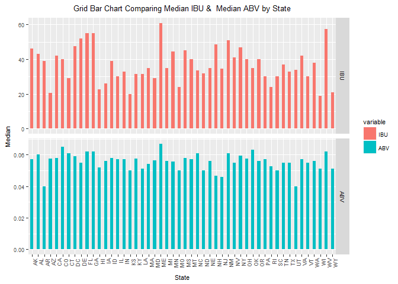
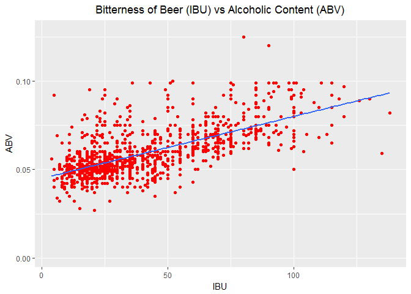

Beers and Breweries in the US
=============================

#### Author: Kevin Okiah

### Introduction

In this report, we explore beers and breweries datasets for the 51
states in the US. The steps and procedures taken in this analysis are
stipulated below.We successfully merged the two datasets `Beers dataset`
which contains a list of 2410 US craft beers and `Breweries dataset`
containing 558 US breweries.

### Structure our repository and files in them

This GitHub Website
{<https://github.com/kevimwe/DoingDataScienceCaseStudy1>} is organised
as follows. The root directory has the following important files and sub
directories.

-   [`README.md`](https://github.com/kevimwe/DoingDataScienceCaseStudy1/blob/master/README.md)
    : This is the landing page of this GitHub analysis repository. It
    provides instructions on the organization of the repository and how
    to run this analysis.
-   [`Case_Study_Batch.Rmd`](https://github.com/kevimwe/DoingDataScienceCaseStudy1/blob/master/Case_Study_Batch.Rmd)
    : This is the engine of this analysis. It knits together all the
    pieces for this analysis by calling R scripts in the analysis
    directory to perform different functions geared towards the
    generation a report of this analysis
-   [`batch.R`](https://github.com/kevimwe/DoingDataScienceCaseStudy1/blob/master/batch.R):
    is used to source `Case_Study_Batch.Rmd` if someone prefers to run
    this analysis in base R rather than an rmarkdown script.
-   [`Case_Study_Batch.md`](https://github.com/kevimwe/DoingDataScienceCaseStudy1/blob/master/Case_Study_Batch.md):
    This is the web readble report for this analysis. it contains both
    source code and outputs of the codes from running this analyis
    broken down in code blocks which are explained in details. The
    graphical images that are used in the `Case_Study_Batch.md`report
    are stored in
    [`/Case_Study_Batch_files/figure-markdown_strict`](https://github.com/kevimwe/DoingDataScienceCaseStudy1/tree/master/Case_Study_Batch_files/figure-markdown_strict) subdirectory.

-   [`/Analysis`](https://github.com/kevimwe/DoingDataScienceCaseStudy1/blob/master/analysis)
    directory is the hub for the R scripts that are used in
    this analysis. The different R scripts are listed below with a brief
    description of their functions.
    -   [`/analysis/load_libraries.R`](https://github.com/kevimwe/DoingDataScienceCaseStudy1/blob/master/analysis/load_libraries.R):
        loads the R libraries used in this analysis using `p_load()`
        function from
        `[pacman`\](<https://cran.r-project.org/web/packages/pacman/vignettes/Introduction_to_pacman.html>)
        library
    -   [`/analysis/load_and_explore_data.R`](https://github.com/kevimwe/DoingDataScienceCaseStudy1/blob/master/analysis/load_and_explore_data.R):
        script loads `Beers` and `Breweries` dataset and performs some
        basic exploratory data analysis.
    -   [`/analysis/Clean_data.R`](https://github.com/kevimwe/DoingDataScienceCaseStudy1/blob/master/analysis/Clean_data.R):
        script performs data cleaning operations on the `Beers` and
        `Breweries` datasets. It renames several confusing columns in
        both datasets.
    -   [`/analysis/Number_of_NAs.R`](https://github.com/kevimwe/DoingDataScienceCaseStudy1/blob/master/analysis/Number_of_NAs.R):
        script counts and reports the number of NA's per columns in the
        merged dataset of `Beers` and `Breweries`.
    -   [`/analysis/ABV_by_State.R`](https://github.com/kevimwe/DoingDataScienceCaseStudy1/blob/master/analysis/ABV_by_State.R):
        Computes and reports the median Alcohol by Volume of the
        beer (ABV) by State.
    -   [`/analysis/IBU_by_State.R`](https://github.com/kevimwe/DoingDataScienceCaseStudy1/blob/master/analysis/IBU_by_State.R):
        Computes and reports the median International Bitterness Units
        of the beer (IBU) by States
    -   [`/analysis/Bar_Chart_Plotter.R`](https://github.com/kevimwe/DoingDataScienceCaseStudy1/blob/master/analysis/Bar_Chart_Plotter.R):
        Uses ggplot2 R library to plot barchart to compare median ABV
        and median IBU by State.
-   [`/data`](https://github.com/kevimwe/DoingDataScienceCaseStudy1/blob/master/data)
    directory holds the datasets that are used in this analysis. The
    datasets ased are listed below.
    -   [`/data/Beers.csv`](https://github.com/kevimwe/DoingDataScienceCaseStudy1/blob/master/data/Beers.csv):
        this is the raw `Beers` dataset
    -   [`/data/Breweries.csv`](https://github.com/kevimwe/DoingDataScienceCaseStudy1/blob/master/data/Breweries.csv):
        this is the raw `Breweries` dataset
    -   [`/data/Brewery_and_Beer_Clean.csv`](https://github.com/kevimwe/DoingDataScienceCaseStudy1/blob/master/data/Brewery_and_Beer_Clean.csv):
        This is the `Beers` and `Breweries` datasets that have been
        cleaned and merged are is ready for analysis

### Running this reproducible research in R

Begin by reading the README.md file in
{<https://github.com/kevimwe/DoingDataScienceCaseStudy1>} directory.
Clone or download this GitHub directory and its subdirectories. This
markdown document can be generated by running `Case_Study_Batch.Rmd` or
`batch.R` if your prefer runnning base R script.

### Analysis

We begin this analysis by loading R libraries that we will need. This is
achived by running
[`load_libraries.R`](https://github.com/kevimwe/DoingDataScienceCaseStudy1/blob/master/analysis/load_libraries.R)
which is in the analysis folder. `load_libraries.R` calls `p_load` from
`pacman` library that checks if a library is installed or not, if not it
installs it and loads the library for the R session

    #get Working Directory
    y<-getwd()
    #load libraries required to run this project
    source(paste0(y,"/analysis/load_libraries.R"))

Once we have loaded all the libraries that we need, we proceed to load
`Beers` and `Breweries` datasets. `load_and_explore_data.R` found in the
analysis folder is geared for this loading and exploratory analysis of
this two dataset. We check for the number or rows and columns, column
names and structure of each dataset using str() command which is
available in base R.
[`load_and_explore_data.R`](https://github.com/kevimwe/DoingDataScienceCaseStudy1/blob/master/analysis/load_and_explore_data.R)
is excecuted by running the codeblock below

    #load data to R
    source(paste0(y,"/analysis/load_and_explore_data.R"))

    ## Beers Data
    ## 'data.frame':    2410 obs. of  7 variables:
    ##  $ Name      : Factor w/ 2305 levels "#001 Golden Amber Lager",..: 1638 577 1705 1842 1819 268 1160 758 1093 486 ...
    ##  $ Beer_ID   : int  1436 2265 2264 2263 2262 2261 2260 2259 2258 2131 ...
    ##  $ ABV       : num  0.05 0.066 0.071 0.09 0.075 0.077 0.045 0.065 0.055 0.086 ...
    ##  $ IBU       : int  NA NA NA NA NA NA NA NA NA NA ...
    ##  $ Brewery_id: int  409 178 178 178 178 178 178 178 178 178 ...
    ##  $ Style     : Factor w/ 100 levels "","Abbey Single Ale",..: 19 18 16 12 16 80 18 22 18 12 ...
    ##  $ Ounces    : num  12 12 12 12 12 12 12 12 12 12 ...
    ## Breweries Data
    ## 'data.frame':    558 obs. of  4 variables:
    ##  $ Brew_ID: int  1 2 3 4 5 6 7 8 9 10 ...
    ##  $ Name   : Factor w/ 551 levels "10 Barrel Brewing Company",..: 355 12 266 319 201 136 227 477 59 491 ...
    ##  $ City   : Factor w/ 384 levels "Abingdon","Abita Springs",..: 228 200 122 299 300 62 91 48 152 136 ...
    ##  $ State  : Factor w/ 51 levels " AK"," AL"," AR",..: 24 18 20 5 5 41 6 23 23 23 ...

From running `load_and_explore_data.R` we verify `Beers Dataset` has
2410 observations of 7 variables where as `Breweries Dateset` has 558
observation of 4 variables. We notice`Name` is a common column name
between the two datesets but means different things. In `Beers Dataset`,
`Name` refers to the name of the beer whereas the `Name` in
`Breweries dataset` refers to the name of the brewery. For our analysis,
renamed `Name` in the `Beers Dataset` to `Beer_Name` and `Name` in the
`Breweries dateset` to `Brewery_Name`. Since we plan to merge the two
dataset using `Brewery_ID`, we renamed `Brew_ID` in the `Brewery datese`
to `Brewery_ID`. This data cleaning is done
[`Clean_data.R`](https://github.com/kevimwe/DoingDataScienceCaseStudy1/blob/master/analysis/Clean_data.R)
which is also in the analysis folder. We print the first 6 rows in each
dataset to very the dataset columns have been renamed correctly. Below
code block runs `Clean_data.R` Script.

    #loading function to clean data
    source(paste0(y,"/analysis/clean_data.R"))

    ## [1] "Brewery Dataset, first 6 rows "
    ##   Brewery_id              Brewery_Name          City State
    ## 1          1        NorthGate Brewing    Minneapolis    MN
    ## 2          2 Against the Grain Brewery    Louisville    KY
    ## 3          3  Jack's Abby Craft Lagers    Framingham    MA
    ## 4          4 Mike Hess Brewing Company     San Diego    CA
    ## 5          5   Fort Point Beer Company San Francisco    CA
    ## 6          6     COAST Brewing Company    Charleston    SC
    ## [1] " "
    ## [1] "Beers Dataset, first 6 rows "
    ##             Beer_Name Beer_ID   ABV IBU Brewery_id
    ## 1            Pub Beer    1436 0.050  NA        409
    ## 2         Devil's Cup    2265 0.066  NA        178
    ## 3 Rise of the Phoenix    2264 0.071  NA        178
    ## 4            Sinister    2263 0.090  NA        178
    ## 5       Sex and Candy    2262 0.075  NA        178
    ## 6        Black Exodus    2261 0.077  NA        178
    ##                            Style Ounces
    ## 1            American Pale Lager     12
    ## 2        American Pale Ale (APA)     12
    ## 3                   American IPA     12
    ## 4 American Double / Imperial IPA     12
    ## 5                   American IPA     12
    ## 6                  Oatmeal Stout     12

### Research Questions

In this section, we address the research questions put together on this
two dataset. The questions are numbered 1 to 7

#### 1. How many breweries are present in each state?

We answer this question by using `count` function in base to count the
number of breweries grouped by "state". This prints put a dataframe with
two columns `state` which is the state name and `freq` which is the
number of breweries in a given state. Each row represents one state.

    count(breweries, "State")

    ##    State freq
    ## 1     AK    7
    ## 2     AL    3
    ## 3     AR    2
    ## 4     AZ   11
    ## 5     CA   39
    ## 6     CO   47
    ## 7     CT    8
    ## 8     DC    1
    ## 9     DE    2
    ## 10    FL   15
    ## 11    GA    7
    ## 12    HI    4
    ## 13    IA    5
    ## 14    ID    5
    ## 15    IL   18
    ## 16    IN   22
    ## 17    KS    3
    ## 18    KY    4
    ## 19    LA    5
    ## 20    MA   23
    ## 21    MD    7
    ## 22    ME    9
    ## 23    MI   32
    ## 24    MN   12
    ## 25    MO    9
    ## 26    MS    2
    ## 27    MT    9
    ## 28    NC   19
    ## 29    ND    1
    ## 30    NE    5
    ## 31    NH    3
    ## 32    NJ    3
    ## 33    NM    4
    ## 34    NV    2
    ## 35    NY   16
    ## 36    OH   15
    ## 37    OK    6
    ## 38    OR   29
    ## 39    PA   25
    ## 40    RI    5
    ## 41    SC    4
    ## 42    SD    1
    ## 43    TN    3
    ## 44    TX   28
    ## 45    UT    4
    ## 46    VA   16
    ## 47    VT   10
    ## 48    WA   23
    ## 49    WI   20
    ## 50    WV    1
    ## 51    WY    4

#### 2. Merge beer data with breweries data by brewery id. Print first 6 observations and the last six observations to check the merged file.

Since we have already cleaned our datasets by remaning the column names
in
[`Clean_data.R`](https://github.com/kevimwe/DoingDataScienceCaseStudy1/blob/master/analysis/Clean_data.R),
we merge `Beers` and `Brewery` datasets by `Brewery_ID` using merge
command for base R and assign the new dataset to `Brewery_and_Beer`. We
use `head()` and `tail()` to print the first and last 6 rows of the
newly created `Brewery_and_Beer` dataset respectively

    # merge two data frames by ID
    Brewery_and_Beer <- merge(breweries,beers,by=c("Brewery_id"))

    print(head(Brewery_and_Beer)) # printing the first 6 observations

    ##   Brewery_id       Brewery_Name        City State     Beer_Name Beer_ID
    ## 1          1 NorthGate Brewing  Minneapolis    MN       Pumpion    2689
    ## 2          1 NorthGate Brewing  Minneapolis    MN    Stronghold    2688
    ## 3          1 NorthGate Brewing  Minneapolis    MN   Parapet ESB    2687
    ## 4          1 NorthGate Brewing  Minneapolis    MN  Get Together    2692
    ## 5          1 NorthGate Brewing  Minneapolis    MN Maggie's Leap    2691
    ## 6          1 NorthGate Brewing  Minneapolis    MN    Wall's End    2690
    ##     ABV IBU                               Style Ounces
    ## 1 0.060  38                         Pumpkin Ale     16
    ## 2 0.060  25                     American Porter     16
    ## 3 0.056  47 Extra Special / Strong Bitter (ESB)     16
    ## 4 0.045  50                        American IPA     16
    ## 5 0.049  26                  Milk / Sweet Stout     16
    ## 6 0.048  19                   English Brown Ale     16

    print(tail(Brewery_and_Beer)) #printing the last 6 observations

    ##      Brewery_id                  Brewery_Name          City State
    ## 2405        556         Ukiah Brewing Company         Ukiah    CA
    ## 2406        557       Butternuts Beer and Ale Garrattsville    NY
    ## 2407        557       Butternuts Beer and Ale Garrattsville    NY
    ## 2408        557       Butternuts Beer and Ale Garrattsville    NY
    ## 2409        557       Butternuts Beer and Ale Garrattsville    NY
    ## 2410        558 Sleeping Lady Brewing Company     Anchorage    AK
    ##                      Beer_Name Beer_ID   ABV IBU                   Style
    ## 2405             Pilsner Ukiah      98 0.055  NA         German Pilsener
    ## 2406         Porkslap Pale Ale      49 0.043  NA American Pale Ale (APA)
    ## 2407           Snapperhead IPA      51 0.068  NA            American IPA
    ## 2408         Moo Thunder Stout      50 0.049  NA      Milk / Sweet Stout
    ## 2409  Heinnieweisse Weissebier      52 0.049  NA              Hefeweizen
    ## 2410 Urban Wilderness Pale Ale      30 0.049  NA        English Pale Ale
    ##      Ounces
    ## 2405     12
    ## 2406     12
    ## 2407     12
    ## 2408     12
    ## 2409     12
    ## 2410     12

#### 3. Report the number of NA’s in each column.

To count the number of NA's in each column of the merged dataset
`Brewery_and_Beer`, we create `Number_of_NAs.R` which has a function
called `NA_counter()`. `NA_Counter()` takes a column and and returns the
number of NA's found in that column. Using Sapply we pass all the
columns in `Brewery_and_Beer` to which returns the number of NA's as
reported below. Calling
[`Number_of_NAs.R`](https://github.com/kevimwe/DoingDataScienceCaseStudy1/blob/master/analysis/Number_of_NAs.R)
as shown in the code block below returns the summary of the number of
NA's per column. International Bitterness Units of beer (IBU) has the
highest number of NA's of all the available variables which is 1005.

    source(paste0(y,"/analysis/Number_of_NAs.R"))

    ##              NAs_count
    ## Brewery_id           0
    ## Brewery_Name         0
    ## City                 0
    ## State                0
    ## Beer_Name            0
    ## Beer_ID              0
    ## ABV                 62
    ## IBU               1005
    ## Style                0
    ## Ounces               0

#### 4. Compute the median alcohol content and international bitterness unit for each state. Plot a bar chart to compare.

We begin by removing NAs in the merged dataset `Brewery_and_Beer` by
calling `na.omit()`. For reference by anyone running the same analyis,
we save the cleaned dataset in
[`/data/Brewery_and_Beer_Clean.csv`](https://github.com/kevimwe/DoingDataScienceCaseStudy1/blob/master/data/Brewery_and_Beer_Clean.csv).This
code block then computes the median alcohol content(ABV) per state by
calling `ABV_by_State.R` and stores the result in a dataframe
`ABV_by_State`. It also computes median International Bitterness Units
of the beer (IBU) per State by calling `IBU_by_State.R` and stores the
result in `IBU_by_State`. `Bar_chart_Plotter.R`, plots a grid bar charts
to comparing median ABV and median IBU in each of the 51 States.

    #Remove NA's
    Brewery_and_Beer_Clean<-na.omit(Brewery_and_Beer)

    # Save the NA free Brewery_and_Beer data in /data/Brewery_and_Beer_Clean.csv
    write.csv(Brewery_and_Beer_Clean, file= paste0(y,"/data/Brewery_and_Beer_Clean.csv"))

    print("Median ABV by State")

    ## [1] "Median ABV by State"

    source(paste0(y,"/analysis/ABV_by_State.R"))

    ##    State    ABV
    ## 1     AK 0.0570
    ## 2     AL 0.0600
    ## 3     AR 0.0400
    ## 4     AZ 0.0575
    ## 5     CA 0.0580
    ## 6     CO 0.0650
    ## 7     CT 0.0610
    ## 8     DC 0.0590
    ## 9     DE 0.0550
    ## 10    FL 0.0620
    ## 11    GA 0.0620
    ## 12    HI 0.0520
    ## 13    IA 0.0560
    ## 14    ID 0.0580
    ## 15    IL 0.0570
    ## 16    IN 0.0570
    ## 17    KS 0.0500
    ## 18    KY 0.0575
    ## 19    LA 0.0510
    ## 20    MA 0.0540
    ## 21    MD 0.0565
    ## 22    ME 0.0670
    ## 23    MI 0.0560
    ## 24    MN 0.0555
    ## 25    MO 0.0500
    ## 26    MS 0.0580
    ## 27    MT 0.0570
    ## 28    NC 0.0610
    ## 29    ND 0.0500
    ## 30    NE 0.0560
    ## 31    NH 0.0465
    ## 32    NJ 0.0460
    ## 33    NM 0.0610
    ## 34    NV 0.0550
    ## 35    NY 0.0595
    ## 36    OH 0.0575
    ## 37    OK 0.0630
    ## 38    OR 0.0560
    ## 39    PA 0.0570
    ## 40    RI 0.0525
    ## 41    SC 0.0500
    ## 43    TN 0.0550
    ## 44    TX 0.0550
    ## 45    UT 0.0400
    ## 46    VA 0.0570
    ## 47    VT 0.0550
    ## 48    WA 0.0560
    ## 49    WI 0.0510
    ## 50    WV 0.0620
    ## 51    WY 0.0510

    print("Median IBU by State")

    ## [1] "Median IBU by State"

    source(paste0(y,"/analysis/IBU_by_State.R"))

    ##    State  IBU
    ## 1     AK 46.0
    ## 2     AL 43.0
    ## 3     AR 39.0
    ## 4     AZ 20.5
    ## 5     CA 42.0
    ## 6     CO 40.0
    ## 7     CT 29.0
    ## 8     DC 47.5
    ## 9     DE 52.0
    ## 10    FL 55.0
    ## 11    GA 55.0
    ## 12    HI 22.5
    ## 13    IA 26.0
    ## 14    ID 39.0
    ## 15    IL 30.0
    ## 16    IN 33.0
    ## 17    KS 20.0
    ## 18    KY 31.5
    ## 19    LA 31.5
    ## 20    MA 35.0
    ## 21    MD 29.0
    ## 22    ME 61.0
    ## 23    MI 35.0
    ## 24    MN 44.5
    ## 25    MO 24.0
    ## 26    MS 45.0
    ## 27    MT 40.0
    ## 28    NC 33.5
    ## 29    ND 32.0
    ## 30    NE 35.0
    ## 31    NH 48.5
    ## 32    NJ 34.5
    ## 33    NM 51.0
    ## 34    NV 41.0
    ## 35    NY 47.0
    ## 36    OH 40.0
    ## 37    OK 35.0
    ## 38    OR 40.0
    ## 39    PA 30.0
    ## 40    RI 24.0
    ## 41    SC 30.0
    ## 43    TN 37.0
    ## 44    TX 33.0
    ## 45    UT 34.0
    ## 46    VA 42.0
    ## 47    VT 30.0
    ## 48    WA 38.0
    ## 49    WI 19.0
    ## 50    WV 57.5
    ## 51    WY 21.0

    Median_IBU_and_ABV<-merge(IBU_by_State,ABV_by_State, by = "State")

    print("Plotting Bar Chart")

    ## [1] "Plotting Bar Chart"

    suppressMessages(source(paste0(y,"/analysis/Bar_Chart_Plotter.R")))

#### 5. Which state has the maximum alcoholic beer? Which state has the most bitter beer?

In this code block, we identify `KY` as the State with the maximum
alcoholic beer and `OR` as the state with the most bitter beer.

    #maximum alcoholic beer

    # select the row with max ABV
    Max_ABV<-data.frame(Brewery_and_Beer_Clean[which(Brewery_and_Beer_Clean$ABV==max(Brewery_and_Beer_Clean$ABV)),])

    print(paste0("The state with the beer with maximum alcohol is ->", Max_ABV$State)) # print the stae with Max alcoholic beer 

    ## [1] "The state with the beer with maximum alcohol is -> KY"

    #state with the most bitter beer
    Max_IBU<-data.frame(Brewery_and_Beer_Clean[which(Brewery_and_Beer_Clean$IBU==max(Brewery_and_Beer_Clean$IBU)),]) # select the row with max IBU

    print(paste0("The state with Most bitter beer is ->", Max_IBU$State)) # print the stae with Max alcoholic beer 

    ## [1] "The state with Most bitter beer is -> OR"

#### 6. Summary statistics for ABV (Alcohol by volume) variable.

To get the summary statistics of ABV by Volume variable, I am using
describeBy function from pysch package to generate descriptive
statistics shown below. To make the summary statistics more readable, I
rename the variable column to Volume.

    summary<-data.frame(describeBy(Brewery_and_Beer_Clean$ABV, Brewery_and_Beer_Clean$Ounces, mat=TRUE), row.names = NULL )# using describeBy function from pysch package for summary by
    #print(summary)

    #rename group name to volume
    names(summary)<- c("item","Volume","vars","n","mean","sd","median","trimmed","mad","min","max","range","skew","kurtosis","se") 
    print(summary)

    ##   item Volume vars   n       mean          sd median    trimmed       mad
    ## 1    1    8.4    1   1 0.09900000          NA  0.099 0.09900000 0.0000000
    ## 2    2     12    1 906 0.05865232 0.012696869  0.056 0.05726722 0.0103782
    ## 3    3     16    1 479 0.06201253 0.014557772  0.059 0.06082078 0.0133434
    ## 4    4   16.9    1   1 0.08500000          NA  0.085 0.08500000 0.0000000
    ## 5    5   19.2    1   8 0.07450000 0.016440368  0.070 0.07450000 0.0074130
    ## 6    6     24    1   7 0.04971429 0.007250616  0.049 0.04971429 0.0044478
    ## 7    7     32    1   3 0.06933333 0.022030282  0.068 0.06933333 0.0296520
    ##     min   max range       skew    kurtosis           se
    ## 1 0.099 0.099 0.000         NA          NA           NA
    ## 2 0.028 0.100 0.072 1.04358578  1.12295033 0.0004218252
    ## 3 0.027 0.125 0.098 0.83423624  0.78285624 0.0006651616
    ## 4 0.085 0.085 0.000         NA          NA           NA
    ## 5 0.053 0.099 0.046 0.49140935 -1.37040971 0.0058125480
    ## 6 0.043 0.065 0.022 1.16651660 -0.03764142 0.0027404752
    ## 7 0.048 0.092 0.044 0.06030106 -2.33333333 0.0127191894

#### 7. Is there a relationship between the bitterness of the beer and its alcoholic content? Draw a scatter plot.

There is a positive correlation between ABV and IBU as shown in the
regression trend line in the scatter plot below. As IBU increase ABV.

    p <- ggplot(Brewery_and_Beer, aes(Brewery_and_Beer$IBU, Brewery_and_Beer$ABV))
    p + geom_point(colour = "red", na.rm=TRUE)+    geom_smooth(method=lm,   # Add linear regression line
                    se=FALSE, na.rm=TRUE) +   # Don't add shaded confidence region
      labs(title = "Bitterness of Beer (IBU) vs Alcoholic Content (ABV)", x = "IBU", y ="ABV") +theme(plot.title = element_text(hjust = 0.5))

### Conclusion

In this report, we have explored Beers and Brewery data in the 51 US
states. We broke our anlysis in 3 major chunks. 1. We began by loading
the `Beers` and `Breweries` datasets. Using exploratory analysis, we
examined the structure of our data,and renamed several columns. 2.
Secondly we Merged our `cleaned` Beer and `Brewery` datasets, identified
the number of missing variable and calculated the median `IBU` and `ABV`
by State which we later plotted side by side bar charts for comparision.
3. We finished by wrapping up our analysis by identifying the linear
relationship between `ABV` and `IBU`. As `ABV` increases to does `IBU`
increase. We can conclude that International Bitterness Units of
beers`IBU` is positively correlated to Alcohol by Volume of the beer
`ABV`.

#### session info

    sessionInfo()

    ## R version 3.3.2 (2016-10-31)
    ## Platform: x86_64-w64-mingw32/x64 (64-bit)
    ## Running under: Windows 10 x64 (build 14393)
    ## 
    ## locale:
    ## [1] LC_COLLATE=English_United States.1252 
    ## [2] LC_CTYPE=English_United States.1252   
    ## [3] LC_MONETARY=English_United States.1252
    ## [4] LC_NUMERIC=C                          
    ## [5] LC_TIME=English_United States.1252    
    ## 
    ## attached base packages:
    ## [1] stats     graphics  grDevices utils     datasets  methods   base     
    ## 
    ## other attached packages:
    ## [1] rmarkdown_1.5  reshape2_1.4.2 taRifx_1.0.6   psych_1.7.5   
    ## [5] plyr_1.8.4     knitr_1.16     ggplot2_2.2.1  pacman_0.4.6  
    ## 
    ## loaded via a namespace (and not attached):
    ##  [1] Rcpp_0.12.8      magrittr_1.5     mnormt_1.5-5     munsell_0.4.3   
    ##  [5] colorspace_1.3-1 lattice_0.20-34  stringr_1.1.0    tools_3.3.2     
    ##  [9] parallel_3.3.2   grid_3.3.2       nlme_3.1-128     gtable_0.2.0    
    ## [13] htmltools_0.3.5  yaml_2.1.14      lazyeval_0.2.0   rprojroot_1.1   
    ## [17] digest_0.6.10    assertthat_0.1   tibble_1.2       evaluate_0.10   
    ## [21] labeling_0.3     stringi_1.1.2    scales_0.4.1     backports_1.0.4 
    ## [25] foreign_0.8-67
